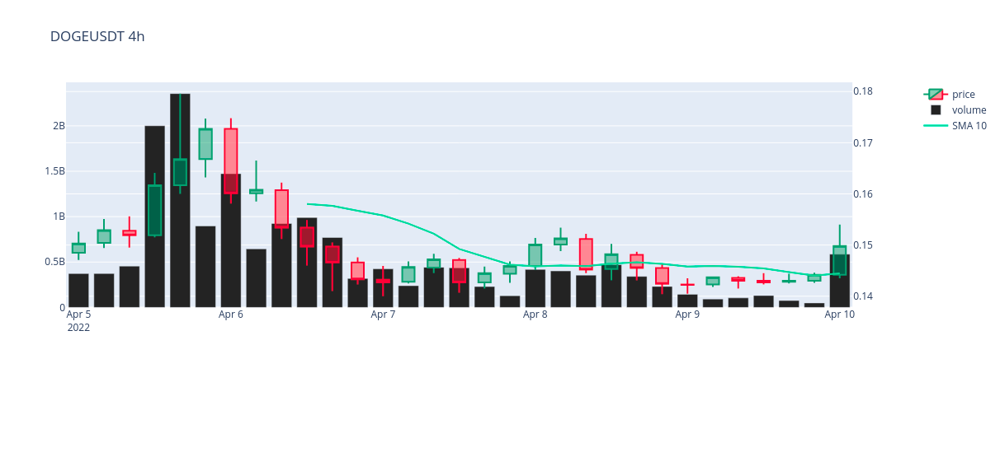

# technical_indicators

### Установка
```bash
git clone https://github.com/tarminik1223/technical_indicators.git
cd technical_indicators
pip install requirements.txt
```

### Использование
Запускаем проект:
```bash
python3 main.py
```

Вводим данные. Например:
```
input pair: DOGEUSDT
input timeframe: 4h
input start: 4-5-2022
input end: 4-10-2022
Input name of the indicator if you want to add one or press "Enter": volume
Input name of the indicator if you want to add one or press "Enter": sma
Input SMA period: 10
Input name of the indicator if you want to add one or press "Enter": 
```

Получаем свечной график:
